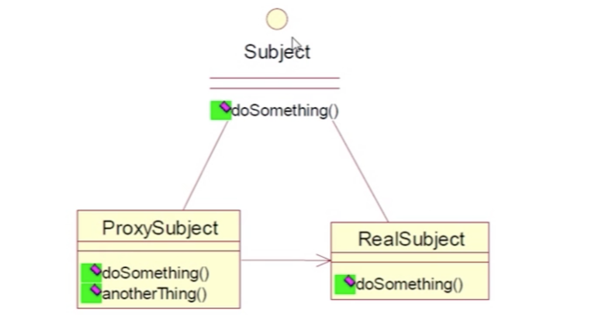
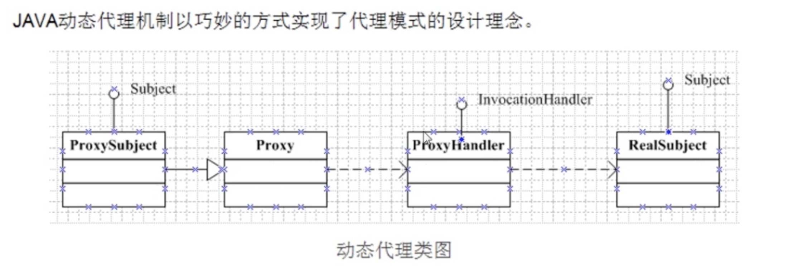
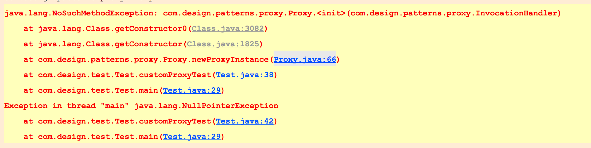
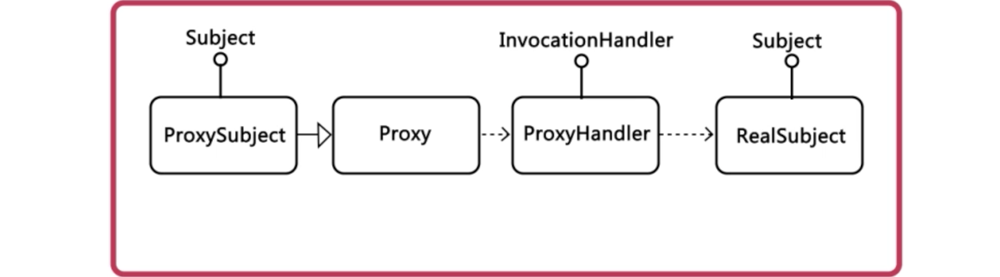
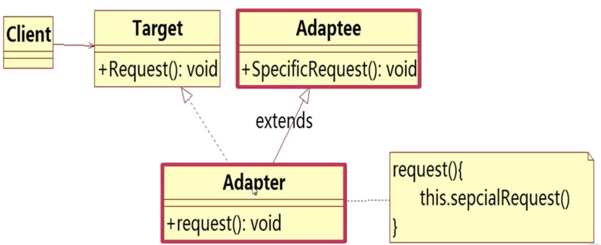

## java设计模式秘密
**什么是设计模式?**

设计模式(Design pattern)是一套被反复使用,多数人知晓,经过分类编目的,代码设计经验的总结
### 懒汉设计模式 与 饿汉式的区别
(I). 饿汉模式的特点是加载类的时候比较慢,但运行时获取对象的速度比较快,线程安全
```java
/**
 * 单例模式 Singleton
 * 应用场合: 有些对象只需要一个就足够了,如:古代的皇帝,老婆
 * 作用: 保证整个应用程序中某个实例有且只有一个
 * 类型: 饿汉式 懒汉式
 */
public class LazySingleton {

    // 1.将构造方法私有化,不允许外部直接创建对象
    private LazySingleton() {
    }

    // 2.创建类的唯一实例
    private static LazySingleton instance = new LazySingleton();

    public static LazySingleton getInstance() {
        return instance;
    }
}
```
(II). 懒汉模式的特点是加载类的时候比较快,但运行时获取对象的速度比较慢,线程不安全
```java
/**
 * 懒汉模式
 */
public class HurrySingleton {

    // 1.将构造方式私有化,不允许外边直接创建对象
    private HurrySingleton() {
    }

    // 2.声明类的唯一实例,使用private static 修饰
    private static HurrySingleton instance;

    // 3.提供一个获取实例的方法,使用 public static 修饰
    public static HurrySingleton getInstance() {

        if (instance == null){
            instance = new HurrySingleton();
        }

        return instance;
    }

}
```
### 观察者设计模式
步骤一: 定义一个更新接口给那些在目标发生改变的时候通知对象
```java
public interface Observer {

    /**
     * 更新接口
     * @param content 传入的目标对象,方便获取目标对象的相应状态
     */
     void update(String content);
}
```
步骤二: 目标对象,它知道观察他的观察者,并提供注册(添加)和删除观察者的接口
```java
public class WeatherSubject {

    // 用来保存和注册观察者对象
    private List<Observer> observers = new ArrayList<>();

    // 把订阅天气的人添加到订阅者列表中
    public void attach(Observer observer) {
        observers.add(observer);
    }

    /**
     * 删除集合中的指定观察者
     */
    public void detach(Observer observer) {
        observers.remove(observer);
    }

    /**
     * 通知所有已经订阅天气的人
     */
    protected void notifyObservers(String content) {
        for (Observer observer : observers) {
            observer.update(content);
        }
    }

}
```
步骤三: 具体的观察者对象,实现更新方法,使自身的状态和目标保持一致
```java
public class ConcreteObserver implements Observer {

    // 天气内容的情况,这个消息从目标处获取
    private String weatherContent;

    // 观察者的名字,是谁收到这个讯息,黄晓明的老婆还是他妈
    private String observerName;


    // 提醒内容:黄明的女朋友提醒约会,而他老妈提醒购物
    private String remindThing;

    public String getWeatherContent() {
        return weatherContent;
    }

    public void setWeatherContent(String weatherContent) {
        this.weatherContent = weatherContent;
    }

    public String getObserverName() {
        return observerName;
    }

    public void setObserverName(String observerName) {
        this.observerName = observerName;
    }


    public String getRemindThing() {
        return remindThing;
    }

    public void setRemindThing(String remindThing) {
        this.remindThing = remindThing;
    }
    /**
     * @param content 获取目标状态到观察者状态中
     */
    @Override
    public void update(String content) {
        System.out.println(observerName + "收到了 " + content +","+remindThing);
    }
}
```
步骤四: 具体的目标对象,把负责有关状态存入相应的观察者对象中
```java
public class ConcreteWeatherSubject extends WeatherSubject {

    // 天气内容的情况,这个消息从目标处获取
    private String weatherContent;

    // 观察者的名字,是谁收到这个讯息,黄晓明的老婆还是他妈
    private String observerName;

    public String getObserverName() {
        return observerName;
    }


    public void setObserverName(String observerName) {
        this.observerName = observerName;
    }

    public String getWeatherContent() {
        return weatherContent;
    }

    public void setWeatherContent(String weatherContent) {
        this.weatherContent = weatherContent;
        // 内容有了,说明天气更新了,通知所有订阅的人
        this.notifyObservers(weatherContent);
    }
}
```
### 代理模式
- **概念:** 为其他对象提供一种代理以控制对这个对象的访问
- **代理模式定义:** 为其他一种代理以控制d对这个对象的访问.代理对象起到中介作用,可以去掉功能服务或增加额外的服务
- **常见的代理模式:** 
  - 远程代理
  - 虚拟代理
  - 保护代理
  - 智能引用代理
- **两种实现方式:** 

一. 静态代理
 
  
```
代理和被代理对象在代理之前是确定的.他们都是实现相同的接口或者继承相同的类
```

   二. 动态代理  
  > java动态代理类位于java.lang.reflect包下,一般涉及到以下两个类:
    
  
(I)Interface InvocationHandler: 该接口中仅定义了一个方法

```
public object invoke(Object obj,Method method,Object[] args)在实际使用时,
第一个参数obj一般指的是代理类,method是被代理的方法,args为该方法的参数数组这个抽象方法在代理类中动态实现
```  
(II)Proxy:该类即为动态代理类
```
static Object newProxyInstance(ClassLoader loader,Class[] interface,InvocationHandler h):
返回代理类的实例,返回后的代理类可以当作被代理类使用(可使用被代理类的在接口中声明过的方法)
```

#### 步骤
1. 创建一个实现接口 InvocationHandler 的类,它必须实现invoke方法
2. 创建被代理的类和接口
3. 调用proxy的静态方法,创建一个代理类
  
```java
newProxyInstance(ClassLoader loader,Class[] interfaces,InvocationHandler h)
```
4. 通过代理调用方法
  
  

### 适配器模式
- 组合
> 采用组合方式的适配器成为对象适配器

特点: 把 "被适配器者" 作为一个对象组合到适配器类,以修改目标接口包装的被适配者

- 继承
> 采用继承方式的称为类适配器

特点: 通过多重继承不兼容接口, 实现对目标接口的匹配单一的为某个类而实现适配
  

### 责任链模式
1. 什么是责任链模式
2. 如何实现责任链模式
3. 责任链模式如何解耦
4. 责任链模式的应用

### 工厂模式
* 概念
```
实例化对象,用工厂方法代替new操作
工厂模式包括工厂方法模式和抽象工厂模式
抽象工厂模式是工厂模式的扩展
```
* 意图
```
定义一个接口创建对象,但是让子类决定哪些类需要被实例化.工厂方法把实例化的工作推迟到子类中去实现
```
* 应用场景
```
1.有一组类似的对象需要创建
2.在编码时不能预见x需要创建哪种类的实例 
3.系统需要考虑扩展性,不应依赖于产品类实例如何被创建,组合和表达细节
```
* 设计思想
1. 尽量松耦合,一个对象的依赖对象的变化与本身无关
2. 具体产品与客户端剥离,责任分割
* 好处

### 模板方法
(I) 什么是模板方法模式

(II) 如何实现模板方法模式

步骤一: 抽象基类,为所有算法提供一个算法框架
```java
public abstract class RefreshBeverage {
    /**
     * 制备饮料的模板方法
     * 封装了所有子类共同遵循的算法框架
     */
    public final void preBeverageTempl() {
        // 步骤1: 将水煮沸
        boilWater();

        // 步骤2: 泡制饮料
        brew();

        // 步骤3: 倒入杯中
        pullInCup();

        // 步骤4: 加入调味料
        addCondiments();

    }

    /**
     * 基本方法: 加入调味料
     */
    protected abstract void addCondiments();

    /**
     * 基本方法: 将饮料倒入杯中
     */
    private void pullInCup() {
        System.out.println("将饮料倒入杯中");
    }

    protected abstract void brew();

    /**
     * 基本方法: 将水煮沸
     */
    private void boilWater() {
        System.out.println("将水煮沸");

    }

}
```
步骤二: 具体子类,提供了咖啡☕️制备的具体实现
```java
public class Coffee extends RefreshBeverage{
    @Override
    protected void addCondiments() {
        System.out.println("加入糖和牛奶");
    }

    @Override
    protected void brew() {
        System.out.println("用沸水冲泡咖啡");
    }
}
```
(III) 模板方法模式的特点